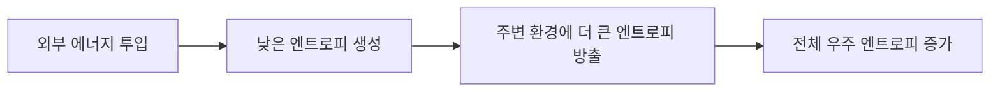
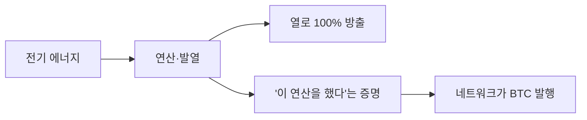
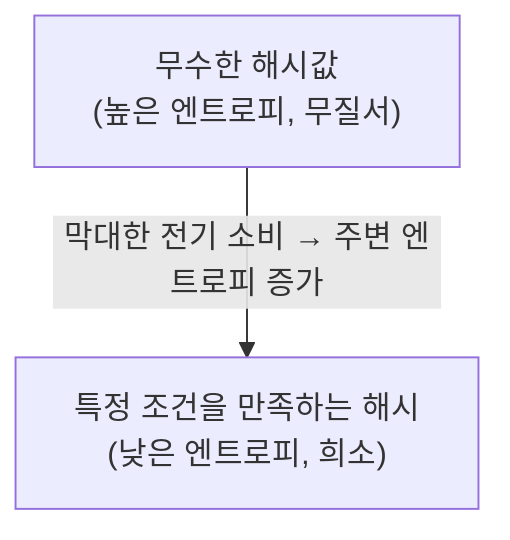
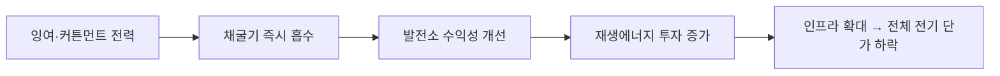
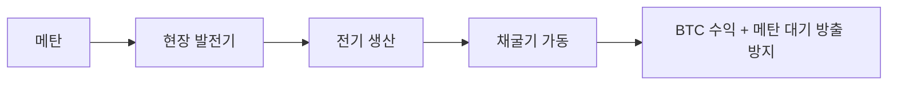
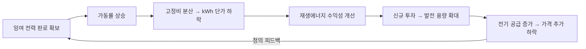
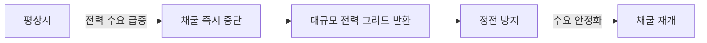

# 에너지와 채굴

- [열역학 법칙 요약](#열역학-법칙-요약)
- [엔트로피란?](#엔트로피란)
- [열역학 법칙 × 비트코인](#열역학-법칙--비트코인)
  - [제0법칙 — 글로벌 단일 기준가격](#제0법칙--글로벌-단일-기준가격)
  - [제1법칙 — 채굴 비용](#제1법칙--채굴-비용)
  - [제2법칙 — 희소성의 근거](#제2법칙--희소성의-근거)
- [비트코인이 에너지 시장에 미치는 영향](#비트코인이-에너지-시장에-미치는-영향)
  - [1. 친환경 에너지 인프라 가속화](#1-친환경-에너지-인프라-가속화)
  - [2. 잉여·고립 에너지 활용](#2-잉여고립-에너지-활용)
  - [3. 전기 가격 디플레이션](#3-전기-가격-디플레이션)
    - [공급 측면 — 고정비 분산과 투자 유인](#공급-측면--고정비-분산과-투자-유인)
    - [수요 측면 — 극도로 탄력적인 수요자](#수요-측면--극도로-탄력적인-수요자)
    - [경쟁 메커니즘 — 더 싼 에너지 발굴 압력](#경쟁-메커니즘--더-싼-에너지-발굴-압력)
  - [4. 전력망 수요 반응](#4-전력망-수요-반응)
- [에너지가 곧 가치다](#에너지가-곧-가치다)
  - [프로토콜의 계층 구조](#프로토콜의-계층-구조)
- [2140년 이후 — 보안 예산과 수수료 시장](#2140년-이후--보안-예산과-수수료-시장)
  - [최종 정산망으로서의 진화](#최종-정산망으로서의-진화)

## 열역학 법칙 요약

| 법칙    | 핵심                                      |
| ------- | ----------------------------------------- |
| 제0법칙 | 열평형 — 두 물체가 같은 온도에 수렴       |
| 제1법칙 | 에너지 보존 — 에너지는 형태만 바뀐다      |
| 제2법칙 | 엔트로피 증가 — 내버려두면 무질서해진다   |
| 제3법칙 | 절대영도 불가 — 완전한 질서에는 도달 불가 |

---

## 엔트로피란?

- 엔트로피 = 에너지가 얼마나 분산되어 있는가
- 온도 자체가 아니라 에너지의 집중도/분산도가 기준
- 낮은 엔트로피 = 에너지가 집중된 상태 (주변과 "다른" 상태)
- 높은 엔트로피 = 에너지가 사방으로 퍼진 상태

| 상태                          | 엔트로피 | 이유                             |
| ----------------------------- | -------- | -------------------------------- |
| 뜨거운 물 (컵 안에 집중)      | 낮음     | 에너지가 한 곳에 집중            |
| 냉장고 뒷면 열 (공기 중 퍼짐) | 높음     | 에너지가 사방으로 분산           |
| 얼음                          | 낮음     | 분자가 규칙적 격자 구조          |
| DNA                           | 낮음     | 수십억 염기가 정확한 순서로 배열 |

---

## 열역학 법칙 × 비트코인

### 제0법칙 — 글로벌 단일 기준가격

제0법칙의 핵심은 열평형의 전이성 이다. A와 B가 각각 C와 열평형이면 A와 B도 열평형 — 이 전이성이 "온도"라는 보편 척도를 정의한다.

비트코인에서의 대응:

| 열역학 제0법칙                       | 비트코인                                                              |
| ------------------------------------ | --------------------------------------------------------------------- |
| A·B가 C와 열평형 → A·B도 서로 열평형 | 모든 거래소가 글로벌 시장과 차익거래로 수렴 → 거래소 간에도 동일 가격 |
| "온도"라는 보편 측정 척도 정의       | BTC 가격이 글로벌 단일 기준가격으로 기능                              |

차익거래는 열 전달과 같다 — 가격 차이(포텐셜 기울기)가 존재하는 한 흐름이 발생하고, 차이가 사라지면 멈춘다.

### 제1법칙 — 채굴 비용

BTC는 에너지가 저장된 게 아니라 에너지를 소비했다는 증명서다.

### 제2법칙 — 희소성의 근거

- BTC 채굴 = 주변 엔트로피를 높이는 대가로 국소적 낮은 엔트로피(희소한 코인)를 생성
- 난이도는 2,016블록(약 2주)마다 전체 해시레이트에 맞춰 자동 조정 — 해시레이트가 높아질수록 유효한 해시를 찾기 더 어려워짐

---

## 비트코인이 에너지 시장에 미치는 영향

### 1. 친환경 에너지 인프라 가속화

재생에너지(태양광, 풍력)의 구조적 문제는 발전량이 수요와 무관하게 결정된다는 점이다. 햇빛이 강하고 바람이 셀 때 전력이 쏟아지지만 수요가 없으면 버려진다(커튼먼트, Curtailment). 미국에서만 연간 수십 TWh가 이렇게 버려진다.

재생에너지 프로젝트의 수익성은 잉여 전력 시간대에 얼마나 팔 수 있느냐에 달려 있다. 채굴기는 이 시간대의 최후 구매자(Buyer of Last Resort) 로 기능하며, 그 자체로 재생에너지 투자의 수익 모델을 완성시킨다.

### 2. 잉여·고립 에너지 활용

전기는 생산 즉시 소비되지 않으면 버려진다. 지리적으로 고립되거나 규모가 작아 수송 인프라가 없는 에너지원이 전 세계에 산재한다. 채굴기는 전기만 있으면 어디든 설치 가능하므로 이 모든 경우에 적용된다.

| 에너지원            | 발생 상황                       | 기존 처리               | 실제 사례                 |
| ------------------- | ------------------------------- | ----------------------- | ------------------------- |
| 플레어 가스 (메탄)  | 유전·매립지·축산농가 부산물     | 대기 방출 또는 플레어링 | 텍사스, 노스다코타 유전   |
| 잉여 수력           | 우기에 댐 발전량이 수요 초과    | 방류(발전 포기)         | 중국 쓰촨성, 파라과이     |
| 지열                | 송전망 없는 오지의 과잉 발전    | 방치                    | 아이슬란드, 엘살바도르    |
| 원자력 심야 잉여    | 출력 조절 불가로 심야 과잉 발생 | 마이너스 가격에 투매    | 미국, 프랑스              |
| 재생에너지 커튼먼트 | 그리드 과부하로 강제 출력 제한  | 발전 포기               | 텍사스(ERCOT), 캘리포니아 |
| 탄광 메탄(CMM)      | 석탄 채굴 시 갱도 배출 메탄     | 대기 방출               | 미국 애팔래치아, 중국     |

메탄의 경우 발생원이 소규모·오지에 분산되어 있어 파이프라인·LNG·CNG 어떤 수송 방법도 채산성이 맞지 않아 플레어링으로 태워버린다. 메탄의 온실효과는 CO₂의 약 80배(20년 기준)이므로, 태우는 것만으로도 CO₂로 전환해 온실효과를 줄이는 효과가 있다. 여기서 채굴기까지 돌리면 수익까지 발생한다.

에너지를 수송하는 게 아니라 채굴기를 에너지로 이동시킨다.

### 3. 전기 가격 디플레이션

전기는 수송 자체가 손실이라 지역별 가격 차이가 유지된다. 채굴기는 전기를 수송하는 대신 채굴기 자신이 전기로 이동해 이 문제를 해결한다.

#### 공급 측면 — 고정비 분산과 투자 유인

발전소의 비용 구조는 대부분 고정비(건설비, 유지비)다. 가동률이 낮으면 이 고정비를 적은 전력량으로 나눠야 하므로 kWh당 단가가 높아진다. 채굴기가 잉여 전력을 사주면:

#### 수요 측면 — 극도로 탄력적인 수요자

일반 소비자는 전기 가격이 올라도 냉난방과 조명을 끄기 어렵다. 채굴기는 다르다. 전기 단가가 채굴 손익분기점을 넘는 순간 즉시 꺼버릴 수 있고, 싼 지역으로 장비를 옮길 수 있다.

- 싼 지역 — 채굴기 유입 → 수요 증가 → 가격 상승 (잉여 소화)
- 비싼 지역 — 채굴기 이탈 → 수요 감소 → 가격 하락 (부담 완화)

이 이동성이 지역 간 전기 가격 격차를 지속적으로 좁혀준다.

#### 경쟁 메커니즘 — 더 싼 에너지 발굴 압력

채굴자들은 가장 싼 전기를 찾아야만 경쟁에서 살아남는다. 이 생존 압력이 지금껏 버려지던 에너지원(플레어 가스, 잉여 수력, 심야 원전)을 계속 발굴하게 만들고, 더 효율적인 에너지 기술 개발을 촉진한다. 장기적으로 인류 전체의 에너지 공급 단가를 낮추는 방향으로 작용한다.

| 측면   | 메커니즘                                               | 결과           |
| ------ | ------------------------------------------------------ | -------------- |
| 공급측 | 잉여 전력 판로 → 가동률 상승 → 고정비 분산 → 투자 유인 | 전기 단가 하락 |
| 수요측 | 가격 민감 채굴기가 싼 곳에 집중 → 지역 간 잉여 흡수    | 가격 평준화    |
| 경쟁   | 채굴자의 최저가 전기 탐색 → 미활용 에너지원 개발 촉진  | 장기 단가 하락 |

### 4. 전력망 수요 반응

채굴기의 또 다른 역할은 수요 반응(Demand Response) 자원이다. 전력 수요가 급증하는 상황에서 채굴기는 수 분 내로 전면 가동을 멈춰 대규모 전력을 즉시 그리드에 돌려줄 수 있다.

2021년 텍사스 한파(Winter Storm Uri) 당시 ERCOT 그리드가 붕괴 직전에 몰렸을 때, 텍사스 내 비트코인 채굴업체들이 자발적으로 채굴을 중단해 약 1,500MW의 전력을 그리드에 반환했다. 이는 중형 원전 1기 출력에 해당하는 규모다.

일반 공장이나 데이터센터는 가동 중단 시 생산 손실이 발생하지만, 채굴기는 언제든 멈췄다 재개해도 손실이 없다. 이 특성이 채굴기를 이상적인 수요 반응 자원으로 만든다.

---

## 에너지가 곧 가치다

인터넷은 정보 전달 비용을 0으로 만들었다. 그런데 바로 그 이유 때문에 디지털 정보는 가치를 담을 수 없었다 — 복사가 자유로운 것은 희소하지 않고, 희소하지 않은 것은 가치를 저장할 수 없다.

비트코인은 이 문제를 에너지로 풀었다. 코인을 발행하려면 반드시 에너지를 소비해야 한다. 복사가 불가능한 이유가 알고리즘의 마법이 아니라, 현실 세계의 열역학적 비용에 뿌리를 두고 있기 때문이다.

|             | 인터넷 (정보)      | 비트코인 (가치)         |
| ----------- | ------------------ | ----------------------- |
| 전달 비용   | 0에 수렴           | 에너지 비용 발생        |
| 복사 가능성 | 자유롭게 복사 가능 | 복사 불가 (희소성 보장) |
| 결과        | 정보의 민주화      | 가치 저장의 탈중앙화    |

금을 채굴하려면 땅을 파고 에너지를 써야 한다. 그 비용이 금을 희소하게 만드는 물리적 근거다. 비트코인의 채굴 비용은 디지털 공간에서 동일한 역할을 한다 — 에너지 소비가 곧 희소성의 증명이고, 희소성이 곧 가치의 근거다.

### 프로토콜의 계층 구조

인터넷이 TCP/IP 위에 HTTP(웹), SMTP(이메일) 등을 쌓아 생태계를 구축했듯이, 비트코인도 베이스 레이어 위에 라이트닝 네트워크(소액결제), 리퀴드(자산 발행) 등 상위 레이어가 쌓이고 있다. 베이스 레이어는 에너지를 소비하며 최종 정산의 신뢰를 만들고, 상위 레이어는 그 신뢰를 빌려 속도와 편의성을 제공한다.

---

## 2140년 이후 — 보안 예산과 수수료 시장

2140년경 마지막 비트코인이 채굴되면 블록 보상은 사라진다. 하지만 그때가 되면 네트워크는 이미 성숙해져, 채굴자들은 비트코인 네트워크 위에서 발생하는 수수료(Transaction Fees) 만으로도 충분한 경제적 인센티브를 얻게 된다.

### 최종 정산망으로서의 진화

채굴 보상이 끝날 시점의 비트코인 레이어 1(Layer 1)은 개인이 커피를 사 마시는 네트워크가 아니다. 중앙은행이나 글로벌 거대 기업, 국가 간의 결제를 처리하는 초거대 규모의 최종 정산망(Settlement Network) 으로 진화해 있을 확률이 높다.

- 이러한 거액의 결제에는 막대한 수수료를 지불할 용의가 충분
- 채굴자들은 수수료 수익만으로도 네트워크 보안을 유지할 경제적 유인 확보
- 개인들의 일상적인 거래는 수수료가 거의 없는 라이트닝 네트워크 등 레이어 2에서 처리

이미 오디널스(Ordinals)나 BRC-20 등의 등장으로 수수료 시장이 활성화될 수 있음이 증명되었다.
