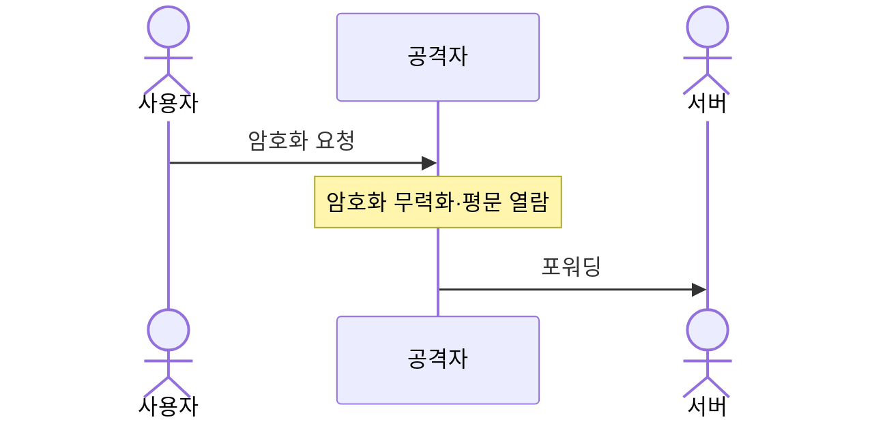
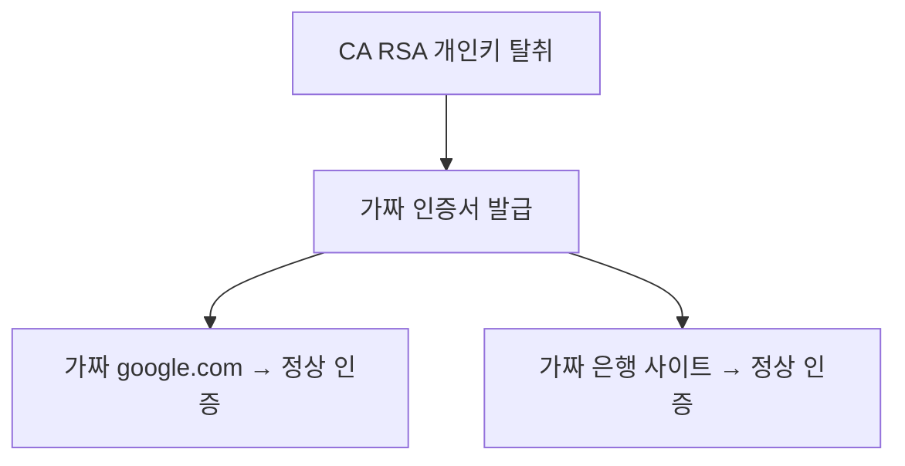
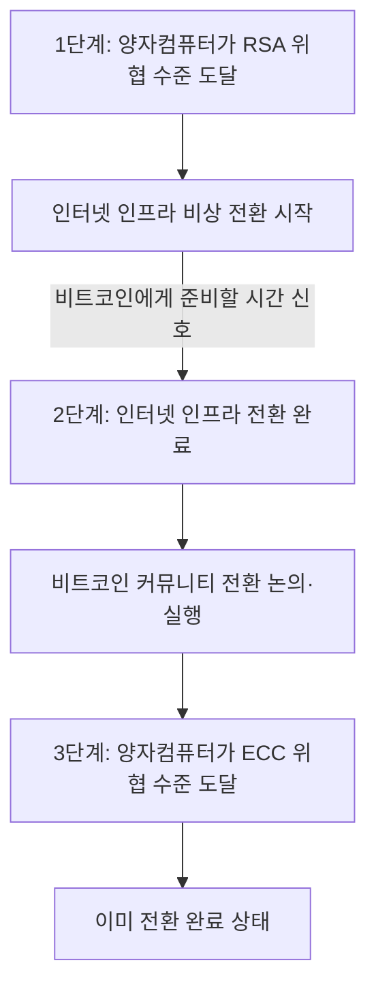

# 보안과 양자컴퓨터

- [암호화 기초와 양자 취약성](#암호화-기초와-양자-취약성)
  - [RSA vs ECC — 키 길이 대비 보안 강도](#rsa-vs-ecc--키-길이-대비-보안-강도)
  - [수학적 기반](#수학적-기반)
  - [양자컴퓨터 관점](#양자컴퓨터-관점)
  - [비트코인 해킹에 드는 비용](#비트코인-해킹에-드는-비용)
  - [시간 제한 비대칭 — 비트코인 취약성은 단일하지 않다](#시간-제한-비대칭--비트코인-취약성은-단일하지-않다)
- [위협 시나리오](#위협-시나리오)
  - [위협 우선순위](#위협-우선순위)
  - [주요 시나리오 상세](#주요-시나리오-상세)
- [현황과 대응](#현황과-대응)
  - [현재 인터넷 인프라 암호화 현황](#현재-인터넷-인프라-암호화-현황)
  - [인터넷 인프라 PQC 전환](#인터넷-인프라-pqc-전환)
  - [비트코인 양자 내성 전환 현황 (2026년 4월)](#비트코인-양자-내성-전환-현황-2026년-4월)
- [로스트코인 동결/방치 논쟁](#로스트코인-동결방치-논쟁)
  - [비트코인 원칙과의 충돌](#비트코인-원칙과의-충돌)
  - [두 진영의 논거](#두-진영의-논거)
  - [결론 — 원칙이냐 실용이냐](#결론--원칙이냐-실용이냐)

## 암호화 기초와 양자 취약성

### RSA vs ECC — 키 길이 대비 보안 강도

| 보안 강도 | RSA 키 길이 | ECC 키 길이 |
| --------- | ----------- | ----------- |
| 80-bit    | 1,024 bit   | 160 bit     |
| 128-bit   | 3,072 bit   | 256 bit     |
| 256-bit   | 15,360 bit  | 512 bit     |

ECC 256bit = RSA 3,072bit 와 동등한 보안성

### 수학적 기반

- RSA — 정수 인수분해 문제 기반 (`N = p × q`에서 p, q 탐색)
- ECC — 타원곡선 이산로그 문제 기반 (공격 경로가 훨씬 적음)

### 양자컴퓨터 관점

| 알고리즘 | 고전 컴퓨터 | 양자컴퓨터 (Shor's Algorithm) |
| -------- | ----------- | ----------------------------- |
| RSA      | 어려움      | 쉽게 뚫림                     |
| ECC      | 더 어려움   | 쉽게 뚫림                     |

쇼어 알고리즘은 두 문제를 모두 다항시간 내 해결한다. 단, 수학적 기반이 달라 RSA가 뚫린다고 ECC가 자동으로 뚫리지는 않는다 — 둘 다 독립적으로 쇼어 알고리즘의 공격 대상이다.

### 비트코인 해킹에 드는 비용

비트코인은 ECC(secp256k1, 256비트)로 보호되며, 이를 깨려면 쇼어 알고리즘을 실행할 수 있는 대규모 양자컴퓨터가 필요하다.

- 256비트 키를 24시간 내 해독: 약 1,300만 개의 물리적 큐비트 필요
- 256비트 키를 1시간 내 해독: 약 3억 1,700만 개의 큐비트 필요
- 현재 최대 양자컴퓨터(수천 큐비트 수준)와 비교하면 4~5자릿수 차이

### 시간 제한 비대칭 — 비트코인 취약성은 단일하지 않다

RSA(TLS 세션키 등)는 암호문을 수집해 두고 나중에 시간 제한 없이 복호화할 수 있다. 비트코인은 공개키 노출 여부에 따라 취약성이 갈린다.

| 공격 대상                         | 공개키 노출          | 시간 제한 | 필요 물리 큐비트       |
| --------------------------------- | -------------------- | --------- | ---------------------- |
| RSA-2048 (HNDL)                   | 암호문만 수집        | 없음      | ~수백만 수준           |
| 비트코인 P2PK (사토시 코인 등)    | 온체인에 영구 노출   | 없음      | ~1,300만 (24시간 기준) |
| 비트코인 재사용 P2PKH             | 이전 지출로 노출됨   | 없음      | ~1,300만 (24시간 기준) |
| 비트코인 표준 거래 (P2PKH/P2WPKH) | 브로드캐스트 시 노출 | ~10분     | 3억 이상               |

- 시간 제한 없는 취약 코인 (약 400~500만 BTC): P2PK 및 재사용 주소 — RSA가 뚫리는 수준의 양자컴퓨터가 나오면 동시에 위협. 사토시 코인 등 초기 P2PK 출력 다수 포함
- 표준 거래: 10분 창 덕분에 RSA보다 수십~수백 배 강한 양자컴퓨터가 필요

---

## 위협 시나리오

### 위협 우선순위

| 시나리오                      | 현실 가능성  | 피해 규모      | 탐지 가능성 |
| ----------------------------- | ------------ | -------------- | ----------- |
| HNDL (지금 수집, 나중에 해독) | 현재 진행 중 | 장기적 대규모  | 사실상 불가 |
| TLS 붕괴                      | 높음         | 인터넷 전체    | 어려움      |
| CA 위조                       | 높음         | 광범위         | 매우 어려움 |
| 코드 서명 위조                | 중간         | 수억 기기      | 어려움      |
| SSH/인프라 침투               | 중간         | 핵심 인프라    | 사후 탐지   |
| 암호화폐 — 레거시 P2PK        | RSA와 동급   | ~400~500만 BTC | 탐지 가능   |
| 암호화폐 — 표준 거래          | 낮음         | 시장 붕괴      | 즉시 탐지   |

### 주요 시나리오 상세

HNDL (Harvest Now, Decrypt Later) — 현재 진행 중

국가 정보기관이 이미 수행 중으로 추정. 지금 전송되는 데이터가 이미 위험한 상태.

TLS/HTTPS 붕괴

인터넷 뱅킹, 로그인, 결제 정보 실시간 탈취. 모든 HTTPS 사이트가 HTTP처럼 노출되는 효과.

CA 인증서 위조

브라우저 자물쇠 아이콘이 의미 없어짐. DNS + 인증서 위조 결합 시 탐지 거의 불가능.

---

## 현황과 대응

### 현재 인터넷 인프라 암호화 현황

| 용도                | 주력 알고리즘               |
| ------------------- | --------------------------- |
| HTTPS (TLS)         | RSA + ECC 혼용              |
| SSL 인증서          | RSA 2048/4096 bit (다수)    |
| SSH                 | RSA (레거시), ECC 점진 전환 |
| 이메일 (PGP/S-MIME) | RSA                         |
| VPN                 | RSA (인증), AES (데이터)    |
| 코드 서명           | RSA                         |

RSA가 지배적인 이유: 1977년 발명 — 수십 년간 표준으로 자리잡음. ECC는 2000년대 이후 도입 → 전환 비용이 큼.

### 인터넷 인프라 PQC 전환

왜 어려운가

전체 스택을 동시에 바꿔야 함

- 인터넷 연결 기기: 수백억 개
- IoT, 산업용 장비, 의료기기 등 업데이트 불가 기기 다수
- 레거시 뱅킹 시스템은 COBOL 기반도 여전히 운영 중

진행 현황

| 시점      | 내용                                         |
| --------- | -------------------------------------------- |
| 2016      | NIST, PQC 표준화 공모 시작                   |
| 2022      | 최종 후보 알고리즘 선정                      |
| 2024      | PQC 표준 공식 확정 (ML-KEM, ML-DSA, SLH-DSA) |
| 2025~     | 주요 벤더 적용 시작                          |
| 2030 목표 | 미국 연방정부 시스템 전환 완료               |

핵심 딜레마

- 너무 일찍 전환 → 막대한 비용, 호환성 문제
- 너무 늦게 전환 → HNDL로 이미 수집된 데이터 복호화됨

### 비트코인 양자 내성 전환 현황 (2026년 4월)

완료된 것

- BIP-360, 2024년 9월 제안 → 2026년 2월 공식 저장소 병합
- BTQ Technologies 테스트넷 v0.3.0 구현 완료 (50명+ 채굴자, 10만+ 블록)

아직 안 된 것

- Bitcoin Core의 공식 구현 진척 없음
- 활성화 타임라인 없음
- 커뮤니티 합의 없음

주요 제안들

| 제안                | 방식                 | 핵심 특징             |
| ------------------- | -------------------- | --------------------- |
| BIP-360 (P2QRH)     | 공개키 노출 제거     | 현재 가장 진전된 제안 |
| SPHINCS+ (SLH-DSA)  | 해시 기반 서명       | NIST 표준, 크기 8KB+  |
| Commit-Delay-Reveal | 2단계 트랜잭션       | 멤풀 노출 창 제거     |
| Hourglass V2        | 로스트코인 지출 제한 | 사토시 코인 등 보호   |

역사적 선례: SegWit(8.5년), Taproot(7.5년)

자연스러운 조기경보 시스템

인터넷 인프라 전환이 사실상 비트코인의 조기경보 시스템 역할을 하게 되는 구조다. 단, 이 논리는 표준 P2PKH/P2WPKH 거래에만 적용된다. 레거시 P2PK 출력(약 400~500만 BTC)은 RSA 위협과 동시에 위협받으므로, 이 코인들에게는 경보 후 대응할 여유가 없다.

---

## 로스트코인 동결/방치 논쟁

여기서 로스트코인은 PQC 전환 경로가 주어졌음에도 이동하지 않은 레거시 P2PK 코인에 한정한다. 공개키가 온체인에 영구 노출된 이 코인들은 PQC 주소로의 자발적 이전이 기술적으로 가능하므로, 충분한 유예 기간 후에도 움직이지 않은 경우 소유자가 없는 것으로 볼 수 있는지가 논쟁의 핵심이다.

### 비트코인 원칙과의 충돌

비트코인의 실제 설계 원칙은 탈중앙성(프로토콜 규칙을 단일 주체가 바꿀 수 없음)과 검열저항성(거래를 막을 수 없음)이다. 원칙 관점에서만 보면 두 선택의 비대칭이 뚜렷하다.

| 선택            | 훼손되는 원칙 | 지켜지는 원칙        | 근거                                                                               |
| --------------- | ------------- | -------------------- | ---------------------------------------------------------------------------------- |
| 로스트코인 동결 | 검열저항성    | 탈중앙성             | 프로토콜이 특정 UTXO 지출을 영구 차단 → 설계상 검열                                |
| 로스트코인 방치 | 없음          | 검열저항성, 탈중앙성 | 프로토콜은 그대로. 양자 세력의 코인 집중은 부의 문제이지 프로토콜 원칙 훼손이 아님 |

원칙만 놓고 보면 방치가 압도적으로 유리하다. 동결파의 실제 논거는 원칙이 아니라 실용적 위험이다.

### 두 진영의 논거

방치파 — 키를 가진 자가 주인이라는 원칙의 일관된 적용

비트코인의 소유권 명제는 단순하다: 키를 가진 자가 주인이다. P2PK 코인은 공개키가 온체인에 노출돼 있어 양자컴퓨터가 개인키를 유도할 수 있다. PQC 전환이라는 대안이 주어진 상황에서 이동하지 않은 것은 보유자의 선택이다. 양자컴퓨터가 개인키를 유도하는 순간 그것도 "키를 가진 자"가 된다 — 이는 프로토콜이 설계된 그대로 작동한 결과다. 자신의 키를 보호할 수 있었는데 하지 않았다면, 그 키에 대한 배타적 소유권 주장은 성립하지 않는다.

동결파 — 실용적 위험

원칙 논쟁보다 현실적 결과를 본다. 양자 능력을 먼저 확보하는 주체가 국가나 빅테크라면 수백만 BTC가 한 세력에 집중된다. PQC 유예 기간이 충분했는지도 주관적이고, 기술적으로 이전이 가능해도 사망하거나 접근 불가한 보유자도 있다. 프로토콜을 건드리는 비용보다 방치의 결과가 더 위험할 수 있다는 입장이다.

비트코인은 분산을 보장하지 않는다

동결파의 "집중이 위험하다" 논거에는 전제 오류가 있다. 비트코인은 설계상 희소성(2,100만 개 고정)을 보장하지 분산을 보장하지 않는다. 집중은 비트코인 탄생 때부터 존재했다.

| 시점      | 집중 현황                                            |
| --------- | ---------------------------------------------------- |
| 2009~2010 | 사토시 나카모토 ~100만 BTC 단독 채굴                 |
| 초기      | 소수 채굴자가 대부분의 초기 블록 독점                |
| 현재      | MicroStrategy ~50만 BTC, ETF 수탁사·거래소 대량 보유 |

BTC를 많이 보유해도 프로토콜을 위협할 수 없다. 블록 생성은 해시레이트가, 규칙 집행은 노드가, 프로토콜 변경은 개발자·노드·채굴자 합의가 결정한다. 코인 집중은 금융시장과 지정학의 문제이지 비트코인 설계 원칙의 문제가 아니다.

### 결론 — 원칙이냐 실용이냐

방치파는 비트코인의 설계 원칙에 더 충실하다. 프로토콜을 건드리지 않고, 검열저항성과 탈중앙성을 훼손하지 않으며, "키를 가진 자가 주인"이라는 명제를 일관되게 적용한다.

동결파는 원칙보다 결과를 본다. 양자 세력으로의 부 집중이 비트코인 생태계에 미치는 현실적 위협이 원칙을 지키는 비용보다 크다고 판단한다.

결국 이 논쟁은 비트코인이 원칙의 시스템인가, 결과의 시스템인가에 대한 질문이다.
